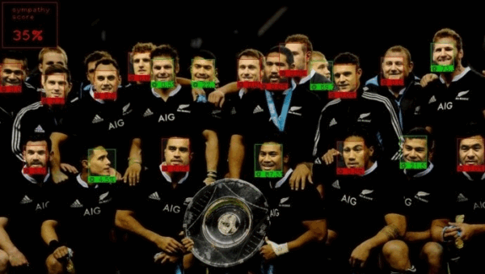
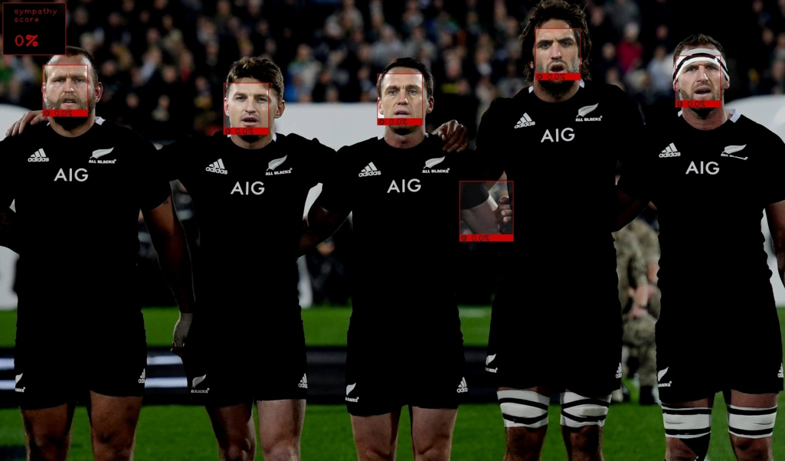
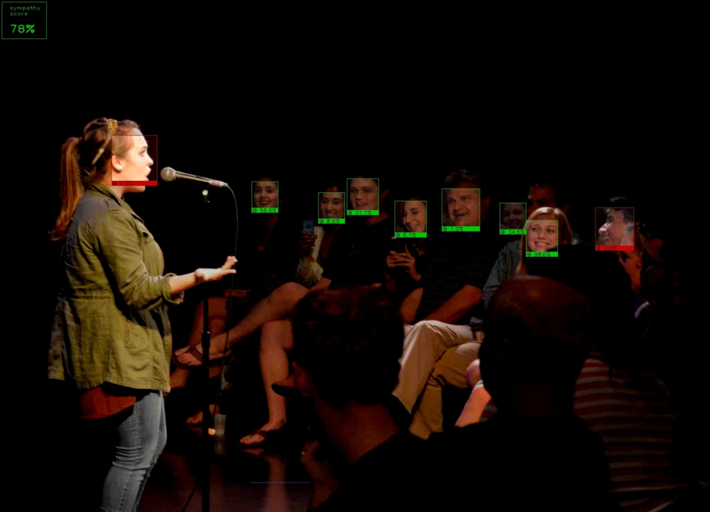
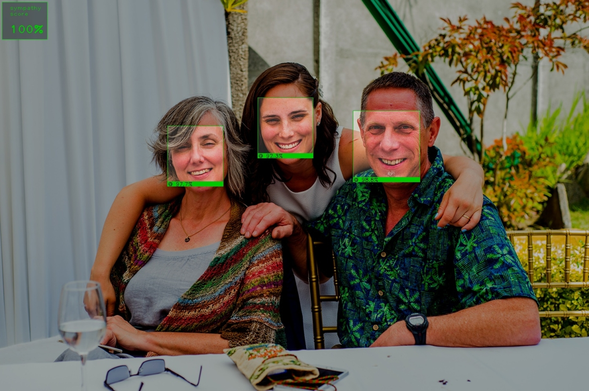
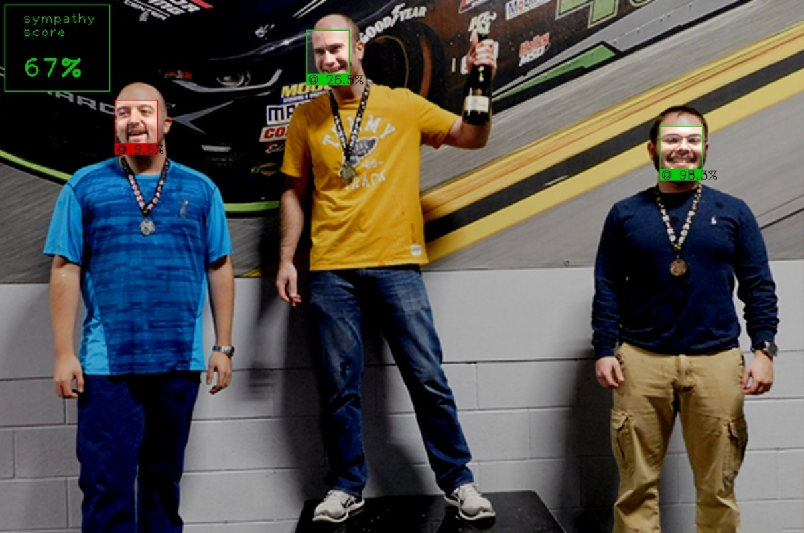

#Sympathy Score detector
### Description:
Fun project that can recognize in a picture faces, then every face put a percentage of smile,
then calculate all smiles and no smiles in a picture and give you a sympathy score.

### Usage:
python simpathy.py -i testo.jpg

### Parameters:

-i or --image -> string

`path to the image to classify.`

-s or --smiling -> float (default=0.5)

`threshold for classify a smile, must be float.`

### Examples:

### Extra:
I included the script that I used for train the network.